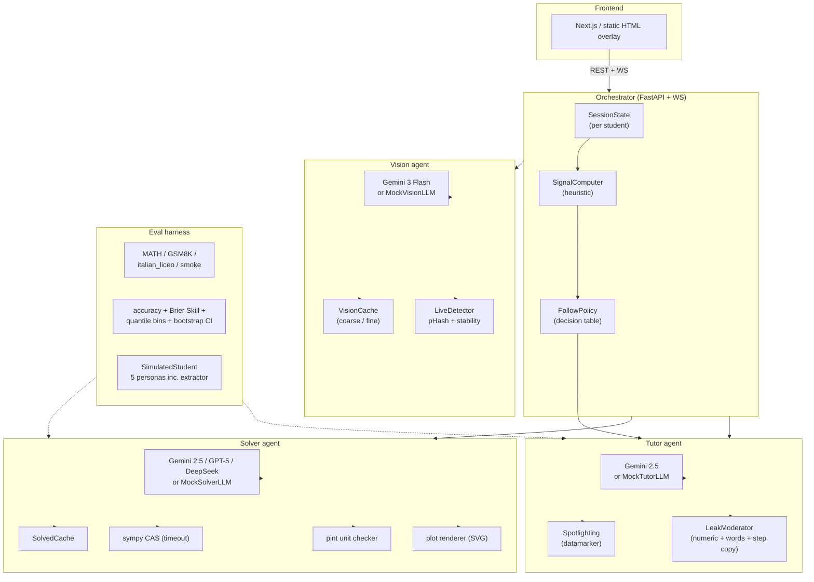

# MCP Behavioral Prompts + Brainer STEM Tutor

This repo hosts two packages under `src/`:

1. **`mcp_prompts_server`** — the original FastMCP server that exposes a set
   of behavioural prompts (project analyst, socratic consultant, code
   reviewer, software architect) as MCP primitives.
2. **`brainer_stem_tutor`** — the Brainer STEM tutoring stack: a verified
   solver, a socratic tutor with an anti-leak moderator, a vision pipeline
   for student notes, an orchestrator that glues them together, and an
   evaluation harness that lets us iterate on prompts with measurable
   metrics.

The MCP server also republishes the STEM stack's system prompts (solver,
tutor, vision) as MCP prompts so other agents can adopt them.

## Why this exists

Brainer wants an app that doesn't solve a STEM problem **for** the student
but accompanies them socratically to discover the solution. The trick: the
system already **knows** the verified answer — so the tutor can guide
without inventing and without giving away the answer even under
prompt-injection attempts.

The stack is structured so that the **safety** (anti-leak), the **control**
(follow policy), and the **intelligence** (LLM) are independent layers that
can be swapped without rewriting each other.

## Architecture



## Quickstart

```bash
# poetry-managed install
poetry install

# or fast iteration without poetry:
pip install pydantic 'pydantic-settings>=2.3' sympy pint pytest \
  'pytest-asyncio>=0.23' pytest-cov mcp[cli] colorlog fastapi httpx ruff mypy

# original MCP server
poetry run python -m mcp_prompts_server.server

# all tests (232) with coverage gate
make test

# eval harness on the built-in smoke dataset
make eval

# end-to-end demo writes a snapshot the static frontend renders
make demo
make serve-frontend   # opens http://localhost:8000

# lint + types
ruff check src/brainer_stem_tutor
mypy src/brainer_stem_tutor
```

## Package layout

```
src/brainer_stem_tutor/
├── shared/         # pydantic schemas + settings (the cross-layer contract)
├── solver/         # SolverAgent + sympy/pint MCP tools + cache + timeout
│   └── mcp_tools/  # sympy_cas, unit_checker, plot_renderer, _timeout
├── tutor/          # TutorAgent + LeakModerator + FollowPolicy + spotlight
├── vision/         # VisionAgent + LiveDetector + VisionCache (Gemini box_2d)
├── orchestrator/   # SessionStore + SignalComputer + Orchestrator + FastAPI
├── adapters/       # GeminiSolverLLM / TutorLLM / VisionLLM + ADK stub
├── eval/           # datasets + GSM8K/MATH scorers + calibration + runners
├── demo_frontend/  # static HTML overlay that renders snapshot.json
└── demo.py         # end-to-end CLI demo
```

## Key invariants

- **SolvedProblem requires at least one VerificationRecord.** The solver
  refuses to close without it. Verifications include numeric or sympy
  back-substitution checks, dimensional analysis with pint, and an
  optional second verifier (Wolfram, gated by confidence).
- **Every sympy call has a wall-clock timeout** (SIGALRM on POSIX main
  thread, threaded fallback otherwise). A hung pathological problem
  surfaces as `ok=False` rather than blocking the agent.
- **The LeakModerator** runs on every tutor turn and rejects messages
  containing the verified `final_answer` as plain digits, scientific
  notation, thousands-grouped, single-digit-spaced, LaTeX-wrapped, or
  spelled out as English / Italian number words. It also bounds quoted
  consecutive solution steps to `MODERATOR_MAX_CONSECUTIVE_STEPS`.
- **Spotlighting (Hines et al. 2024)** wraps every student turn in a
  sentinel character so the LLM treats user input strictly as data.
- **FollowPolicy is deterministic.** Signals → strategy is a table the
  LLM cannot override.

## Evaluation baseline (mock stack)

```
solver (C0_mock): n=5  acc=1.00  acc_verified=1.00  brier=0.006  conf=0.94
tutor  (C0_mock): n=75 leak_rate=0.000  (5 personas, inc. extractor + shortcut)
coverage:                90%  (gate: 85%)
```

Replace `MockSolverLLM` / `MockTutorLLM` / `MockVisionLLM` with the real
Gemini / GPT / DeepSeek implementations (see `adapters/gemini.py`) and the
same harness measures the delta. ADK 2026 wiring lives in
`adapters/adk.py` and uses the canonical `McpToolset(connection_params=
StdioConnectionParams(...))` pattern.

## Roadmap

The Python backend, MCP tools, evaluation harness, real-LLM adapter
scaffolding and static demo frontend are complete and ruff + mypy + 232
tests clean. Next phases:

- Replace mocks with Gemini-backed adapters using real API keys.
- Run benchmarks on full MATH + GSM8K test sets and publish a report.
- Build the Next.js 15 frontend on top of the existing static overlay.

## Repo conventions

- Develop on the branch indicated by the task; pushes go there.
- Tests under `tests/`, one folder per layer. `conftest.py` puts `src/`
  on `sys.path` so `pytest -q` works without a poetry install.
- No emojis in code or commit messages.
- Every commit must keep ruff, mypy, and the test suite green.
